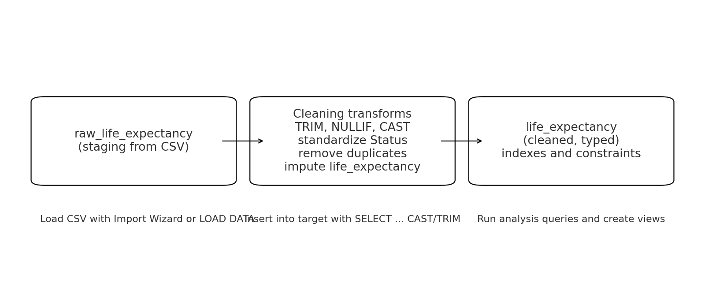
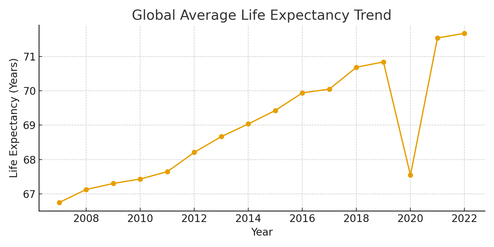

# World Life Expectancy SQL Project  

  
  
  
  

---

## Motivation  
This project is part of my SQL portfolio. It demonstrates my ability to:  
- Design a database schema for real-world health data  
- Clean and transform raw CSVs into structured SQL tables  
- Perform exploratory data analysis (EDA) with SQL  
- Communicate insights using queries, charts, and documentation  

The dataset covers **life expectancy** and related health indicators across countries and years, making it ideal for showcasing SQL skills in cleaning, analysis, and reporting.  

---

## Dataset  
**File:** `WorldLifeExpectancy.csv`  
**Rows:** ~2,941  
**Columns:** 18  

**Main variables:**  
- Demographics: Country, Year, Status (Developed/Developing)  
- Health outcomes: Life expectancy, Adult Mortality, Infant deaths, HIV/AIDS, Measles  
- Economic factors: GDP, Percentage expenditure  
- Education: Schooling  
- Nutrition: BMI, Thinness (age groups)  

---

## Quickstart: How to Run This Project  

### Prerequisites  
- Install [MySQL](https://dev.mysql.com/downloads/) and [MySQL Workbench](https://dev.mysql.com/downloads/workbench/).  
- Clone this repository:  
  ```bash
  git clone https://github.com/YOUR-USERNAME/world-life-expectancy-sql.git
  cd world-life-expectancy-sql
  ```

### Steps  
1. Open **MySQL Workbench**.  
2. Run `sql/schema.sql` to create the database and tables.  
3. Import `data/WorldLifeExpectancy.csv` into the `raw_life_expectancy` table (Workbench Import Wizard or `LOAD DATA`).  
4. Run `sql/cleaning.sql` to clean and transform the dataset into `life_expectancy`.  
5. Run `sql/analysis.sql` to explore key insights.  
6. View query outputs and charts in the `docs/` folder.  

---

## Database Design  
Two tables were created:  
1. **raw_life_expectancy** – staging table directly loaded from CSV  
2. **life_expectancy** – cleaned table with proper types, constraints, and indexes  

  
*CSV → Staging → Cleaning → Final table*  

### Schema  
  

---

## Data Cleaning  
Steps applied in `sql/cleaning.sql`:  
- Removed leading/trailing spaces in text fields  
- Converted empty strings to NULL  
- Casted numeric columns into proper types  
- Standardized `Status` (Developed vs Developing)  
- Removed duplicates (`country + year`)  
- Imputed missing life expectancy values using country averages  
- Added indexes for performance  

---

## Exploratory Queries  
All queries are in `sql/analysis.sql`. Some highlights:  

### Global Trend  
```sql
SELECT year, ROUND(AVG(life_expectancy),2) AS world_avg_life
FROM life_expectancy
GROUP BY year
ORDER BY year;
```
  

### South Africa Historical Trend  
```sql
SELECT year, life_expectancy
FROM life_expectancy
WHERE country = 'South Africa'
ORDER BY year;
```
  

### GDP vs Life Expectancy  
```sql
-- Correlation using Pearson formula
WITH s AS (
  SELECT COUNT(*) AS n, SUM(gdp) AS sx, SUM(life_expectancy) AS sy,
         SUM(gdp*life_expectancy) AS sxy, SUM(gdp*gdp) AS sx2, SUM(life_expectancy*life_expectancy) AS sy2
  FROM life_expectancy
  WHERE gdp IS NOT NULL AND life_expectancy IS NOT NULL
)
SELECT ROUND((n*sxy - sx*sy) / SQRT((n*sx2 - sx*sx)*(n*sy2 - sy*sy)),4) AS corr_gdp_life
FROM s;
```
  

### HIV/AIDS Analysis  
```sql
SELECT country, MAX(hiv_aids) AS max_hiv
FROM life_expectancy
GROUP BY country
ORDER BY max_hiv DESC
LIMIT 10;
```
  

---

## Key Insights  
- GDP is **positively correlated** with life expectancy.  
- Infant deaths are a strong negative driver of life expectancy.  
- South Africa saw a drop in life expectancy in the early 2000s due to HIV/AIDS.  
- Countries with higher average **schooling years** show longer life expectancy.  

---

## Project Structure  
```
world-life-expectancy-sql/
│── data/
│   └── WorldLifeExpectancy.csv
│── sql/
│   ├── schema.sql
│   ├── cleaning.sql
│   └── analysis.sql
│── docs/
│   ├── global_trend.png
│   ├── south_africa_trend.png
│   ├── gdp_vs_life.png
│   ├── top10_hiv.png
│   ├── erd_life_expectancy.png
│   └── etl_flow.png
│── README.md
```  

---

## Future Work  
- Build **views** for common analyses (e.g., regional dashboards).  
- Automate ETL with Python or Airflow.  
- Connect cleaned SQL tables to a **Power BI** or **Tableau dashboard**.  
- Explore predictive modeling using regression on GDP, schooling, and mortality.  

---

## License  
MIT License  
